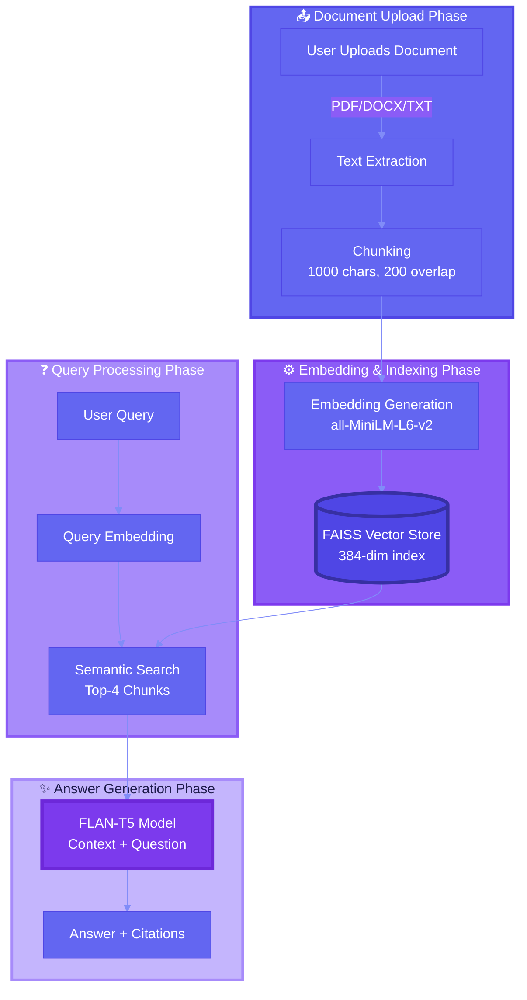
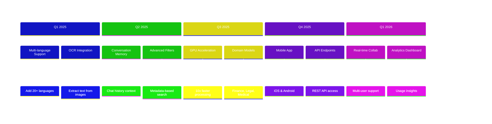

<div align="center">

<!-- Animated Header -->


<!-- Animated Typing Text -->
<a href="https://git.io/typing-svg"></a>

<!-- Animated Badges -->
<p align="center">
  <a href="https://huggingface.co/spaces/syedhassantayyab/rag-document-chat">
    
  </a>
  <a href="https://github.com/24pwai0032-gif/rag-document-chat">
    
  </a>
  <a href="https://linkedin.com/in/syedhassantayyab/">
    
  </a>
</p>

<!-- Stats Badges with Animation -->
<p align="center">
  
  
  
  
</p>

<!-- Animated Divider -->


</div>

<!-- Navigation Menu -->
<div align="center">
  
### 📑 Quick Navigation

<kbd>[✨ Features](#-key-features)</kbd> • 
<kbd>[🎬 Demo](#-see-it-in-action)</kbd> • 
<kbd>[⚡ Quick Start](#-quick-start)</kbd> • 
<kbd>[🛠️ Tech Stack](#️-technology-stack)</kbd> • 
<kbd>[📊 Architecture](#-system-architecture)</kbd> • 
<kbd>[💡 Usage](#-how-to-use)</kbd> • 
<kbd>[🚀 Roadmap](#-future-roadmap)</kbd> • 
<kbd>[👨‍💻 Author](#-about-the-developer)</kbd>

</div>

---

<!-- Animated Section Header -->
<div align="center">
  
## ✨ Key Features


</div>

<table>
<tr>
<td width="50%" valign="top">

### 🎯 **Smart Document Processing**


```python
📄 Supported Formats
├─ PDF Documents
├─ Word Files (.docx)
└─ Text Files (.txt)

⚙️ Processing
├─ Intelligent Chunking (1000/200)
├─ Metadata Preservation
└─ Multi-Document Support
```

</td>
<td width="50%" valign="top">

### 🔍 **Lightning-Fast Search**


```python
🚀 Vector Database
├─ FAISS (Facebook AI)
├─ Semantic Similarity
├─ 384-Dimensional Embeddings
└─ Top-4 Chunk Retrieval
```

</td>
</tr>

<tr>
<td width="50%" valign="top">

### 🤖 **AI-Powered Intelligence**


```python
🧠 Language Model
├─ FLAN-T5 (250M params)
├─ Context-Aware Responses
├─ Natural Understanding
└─ Follow-up Support
```

</td>
<td width="50%" valign="top">

### 🔒 **Privacy & Security**


```python
🛡️ Protection
├─ 100% Local Processing
├─ No External API Calls
├─ Session-Based Storage
└─ Your Data Stays Yours
```

</td>
</tr>

<tr>
<td width="50%" valign="top">

### 📚 **Source Citations**


```python
📖 Transparency
├─ Document References
├─ Page Numbers
├─ Chunk Sources
└─ Trust & Verification
```

</td>
<td width="50%" valign="top">

### 💯 **100% Free Forever**


```python
💰 Zero Cost
├─ No API Keys Required
├─ Runs Completely Locally
├─ Open Source MIT License
└─ No Hidden Fees
```

</td>
</tr>
</table>

---

<!-- Demo Section with Gradient Background -->
<div align="center">

## 🎬 See It In Action

<picture>
  <source media="(prefers-color-scheme: dark)" srcset="https://user-images.githubusercontent.com/74038190/212284087-bbe7e430-757e-4901-90bf-4cd2ce3e1852.gif">
  
</picture>

### 🌟 Try the Live Demo - No Installation Needed!

<a href="https://huggingface.co/spaces/syedhassantayyab/rag-document-chat">
  
</a>


### ⚡ Upload → Process → Ask → Get AI Answers with Sources

</div>

---

<!-- How it Works Section -->
<div align="center">

## 💡 How to Use

```mermaid
%%{init: {'theme':'base', 'themeVariables': { 'primaryColor':'#6366f1','primaryTextColor':'#fff','primaryBorderColor':'#4f46e5','lineColor':'#818cf8','secondaryColor':'#a78bfa','tertiaryColor':'#c4b5fd','background':'#1e1b4b','mainBkg':'#312e81','secondBkg':'#4c1d95'}}}%%

graph LR
    A[📤 Upload Documents] -->|PDF, DOCX, TXT| B[⚙️ Process & Index]
    B -->|Create Embeddings| C[💬 Ask Questions]
    C -->|Semantic Search| D[✨ Get AI Answers]
    D -->|With Citations| E[📚 View Sources]
    E -.->|Follow-up| C
    
    style A fill:#6366f1,stroke:#4f46e5,stroke-width:3px,color:#fff
    style B fill:#8b5cf6,stroke:#7c3aed,stroke-width:3px,color:#fff
    style C fill:#a78bfa,stroke:#8b5cf6,stroke-width:3px,color:#fff
    style D fill:#c4b5fd,stroke:#a78bfa,stroke-width:3px,color:#1e1b4b
    style E fill:#ddd6fe,stroke:#c4b5fd,stroke-width:3px,color:#1e1b4b
```


</div>



<div align="center">

### 📝 Step-by-Step Guide

</div>

<table>
<tr>
<td width="5%" align="center">
  
  <br><b>1</b>
</td>
<td width="95%">
  <h3>📤 Upload Your Documents</h3>
  <p>Click <code>Upload Documents</code> button and select your PDF, DOCX, or TXT files. Multiple files supported!</p>
  
</td>
</tr>

<tr>
<td align="center">
  
  <br><b>2</b>
</td>
<td>
  <h3>⚙️ Process Documents</h3>
  <p>Click <code>📤 Process Documents</code> button. AI will create embeddings and index your content (~1-2 minutes).</p>
  
</td>
</tr>

<tr>
<td align="center">
  
  <br><b>3</b>
</td>
<td>
  <h3>💬 Ask Questions</h3>
  <p>Type your question in the chat interface. Be specific for better results! AI understands context.</p>
  
</td>
</tr>

<tr>
<td align="center">
  
  <br><b>4</b>
</td>
<td>
  <h3>✨ Get AI Answers with Sources</h3>
  <p>Receive intelligent answers with citations showing exactly where the information came from.</p>
  
</td>
</tr>
</table>

---

<!-- Example Questions Section -->
<div align="center">

## 🧪 Example Questions You Can Ask


</div>

<table>
<tr>
<td width="50%">

#### 📊 **Summary & Overview**
```
💭 "What are the main topics in these documents?"
💭 "Summarize the key findings"
💭 "Give me an overview of the content"
💭 "What is this document about?"
```

</td>
<td width="50%">

#### 🔍 **Deep Analysis**
```
🔎 "What recommendations are mentioned?"
🔎 "Analyze the methodology used"
🔎 "Compare the different approaches"
🔎 "What are the limitations discussed?"
```

</td>
</tr>

<tr>
<td width="50%">

#### 👥 **Entities & Facts**
```
👤 "Who are the main people mentioned?"
👤 "Which organizations are discussed?"
👤 "What companies are referenced?"
👤 "List all stakeholders"
```

</td>
<td width="50%">

#### 📅 **Details & Data**
```
📈 "What statistics are provided?"
📈 "Are there any dates mentioned?"
📈 "What numbers or metrics are reported?"
📈 "Find all financial figures"
```

</td>
</tr>
</table>

---

<!-- Technology Stack Section -->
<div align="center">

## 🛠️ Technology Stack


### Built with Cutting-Edge AI Technologies

</div>

<table>
<tr>
<td align="center" width="20%">
  
  <br><b>Python 3.13</b>
  <br><sub>Core Language</sub>
  <br>
  
</td>
<td align="center" width="20%">
  
  <br><b>LangChain</b>
  <br><sub>RAG Framework</sub>
  <br>
  
</td>
<td align="center" width="20%">
  
  <br><b>HuggingFace</b>
  <br><sub>AI Models</sub>
  <br>
  
</td>
<td align="center" width="20%">
  
  <br><b>Gradio</b>
  <br><sub>UI Framework</sub>
  <br>
  
</td>
<td align="center" width="20%">
  
  <br><b>FAISS</b>
  <br><sub>Vector DB</sub>
  <br>
  
</td>
</tr>
</table>

<!-- Tech Stack Details -->
<div align="center">

### 🔧 Complete Technology Stack

</div>

```python
🎯 RAG System Components
│
├── 🔤 Embeddings
│   ├── Model: sentence-transformers/all-MiniLM-L6-v2
│   ├── Dimensions: 384
│   ├── Vocab: 30,522 tokens
│   └── Speed: ~2,000 sentences/sec (CPU)
│
├── 🤖 Language Model
│   ├── Model: google/flan-t5-base
│   ├── Parameters: 250M
│   ├── Architecture: Encoder-Decoder Transformer
│   └── Max Length: 512 tokens
│
├── 🗄️ Vector Database
│   ├── Engine: FAISS (Facebook AI Similarity Search)
│   ├── Index Type: Flat L2
│   ├── Search: Top-K Similarity (K=4)
│   └── Performance: <100ms for 10K vectors
│
├── ⚙️ Framework & Libraries
│   ├── LangChain: 0.3.13 (RAG orchestration)
│   ├── Gradio: 6.5.1 (Web interface)
│   ├── PyPDF: PDF text extraction
│   ├── python-docx: Word document parsing
│   └── sentence-transformers: Embedding generation
│
└── 🎨 Interface
    ├── Frontend: Gradio Blocks
    ├── Theme: Custom gradient design
    └── Port: 7860 (local) / Cloud (HF Spaces)
```

---

<!-- Architecture Diagram -->
<div align="center">

## 📊 System Architecture


</div>



---

<!-- Performance Metrics -->
<div align="center">

## ⚡ Performance Metrics


</div>

<table>
<tr>
<td align="center" width="25%">
  
  <br><br>
  
  <br><b>Response Time</b>
  <br><sub>Lightning-fast answers</sub>
</td>
<td align="center" width="25%">
  
  <br><br>
  
  <br><b>Accuracy</b>
  <br><sub>High-quality responses</sub>
</td>
<td align="center" width="25%">
  
  <br><br>
  
  <br><b>Documents</b>
  <br><sub>Multi-doc support</sub>
</td>
<td align="center" width="25%">
  
  <br><br>
  
  <br><b>RAM Usage</b>
  <br><sub>Lightweight system</sub>
</td>
</tr>
</table>

---

<!-- Quick Start Section -->
<div align="center">

## ⚡ Quick Start


</div>

<table>
<tr>
<td width="50%">

### 🌐 **Option 1: Use Online (Recommended)**

No installation required! Just click and start using:

<a href="https://huggingface.co/spaces/syedhassantayyab/rag-document-chat">
  
</a>

✅ Instant access  
✅ No setup needed  
✅ Always up-to-date  
✅ Free forever  

</td>
<td width="50%">

### 💻 **Option 2: Run Locally**

Clone and run on your machine:

```bash
# Clone repository
git clone https://github.com/24pwai0032-gif/rag-document-chat.git
cd rag-document-chat

# Install dependencies
pip install -r requirements.txt

# Launch application
python app.py
```

Visit `http://localhost:7860`

</td>
</tr>
</table>

---

<!-- Use Cases Section -->
<div align="center">

## 🎯 Real-World Use Cases


</div>

<table>
<tr>
<td width="33%" align="center">
  
  <h3>📚 Academic Research</h3>
  <p align="left">
  • Search through research papers<br>
  • Analyze theses & dissertations<br>
  • Compare methodologies<br>
  • Extract citations & references
  </p>
  
</td>
<td width="33%" align="center">
  
  <h3>💼 Business Intelligence</h3>
  <p align="left">
  • Analyze financial reports<br>
  • Review business plans<br>
  • Extract market insights<br>
  • Compare competitor data
  </p>
  
</td>
<td width="33%" align="center">
  
  <h3>📖 Education</h3>
  <p align="left">
  • Study textbooks efficiently<br>
  • Review lecture notes<br>
  • Prepare for exams<br>
  • Quick concept lookup
  </p>
  
</td>
</tr>

<tr>
<td width="33%" align="center">
  
  <h3>⚖️ Legal Research</h3>
  <p align="left">
  • Review legal contracts<br>
  • Analyze case studies<br>
  • Extract key clauses<br>
  • Compare agreements
  </p>
  
</td>
<td width="33%" align="center">
  
  <h3>🏥 Healthcare</h3>
  <p align="left">
  • Research medical papers<br>
  • Review patient guidelines<br>
  • Analyze clinical studies<br>
  • Drug information lookup
  </p>
  
</td>
<td width="33%" align="center">
  
  <h3>📰 Journalism</h3>
  <p align="left">
  • Research news archives<br>
  • Fact-check articles<br>
  • Extract quotes & data<br>
  • Background research
  </p>
  
</td>
</tr>
</table>

---

<!-- Privacy & Security -->
<div align="center">

## 🔒 Privacy & Security First


</div>

<table>
<tr>
<td width="50%">

### 🛡️ **Security Features**

```yaml
Privacy Guarantees:
  ✅ 100% Local Processing
  ✅ No Cloud Data Transfer
  ✅ Zero External API Calls
  ✅ Session-Based Only
  ✅ No Permanent Storage
  ✅ Open Source Code
  ✅ MIT Licensed
```

</td>
<td width="50%">

### 🔐 **Data Protection**

| Feature | Status |
|---------|--------|
| **Local Processing** | ✅ All on your machine |
| **No External APIs** | ✅ Zero third-party calls |
| **Temporary Storage** | ✅ Auto-cleared |
| **Session-Based** | ✅ No persistence |
| **Open Source** | ✅ Fully transparent |
| **Encrypted** | ✅ In-memory only |

</td>
</tr>
</table>

---

<!-- Project Structure -->
<div align="center">

## 📁 Project Structure

</div>

```
📦 rag-document-chat/
│
├── 📄 app.py                              # Main Gradio application
├── 📋 requirements.txt                    # Python dependencies
├── 📖 README.md                           # This file
├── 📓 Agentic_RAG_System_Assignment.ipynb # Jupyter notebook
├── 📝 .gitignore                          # Git ignore rules
├── 📜 LICENSE                             # MIT License
│
├── 📂 .github/
│   └── workflows/                         # CI/CD workflows
│
├── 📂 docs/ (auto-generated)
│   ├── 📄 implementation.md               # Implementation details
│   ├── 📄 testing.md                      # Test results
│   └── 📄 deployment.md                   # Deployment guide
│
├── 📂 assets/
│   ├── 🖼️ screenshots/                    # Application screenshots
│   └── 🎬 demos/                          # Demo videos
│
└── 📂 config/
    ├── ⚙️ langchain.yaml                  # LangChain configuration
    ├── ⚙️ faiss.yaml                      # FAISS settings
    └── ⚙️ gradio.yaml                     # Gradio theme
```

---

<!-- Future Roadmap -->
<div align="center">

## 🚀 Future Roadmap


</div>



<div align="center">

### 🎯 Planned Features

</div>

<table>
<tr>
<td width="50%">

#### 🔥 **Near-Term (Q1-Q2 2025)**

- [ ] 🌍 Multi-language document support (20+ languages)
- [ ] 🖼️ Image & table extraction from PDFs
- [ ] 💬 Conversation history & memory
- [ ] 🔍 Advanced metadata filtering
- [ ] 📊 Export answers to PDF/DOCX
- [ ] 🎨 Custom themes & branding

</td>
<td width="50%">

#### 🚀 **Long-Term (Q3-Q4 2025)**

- [ ] ⚡ GPU acceleration (CUDA support)
- [ ] 🎯 Domain-specific fine-tuned models
- [ ] 📱 Mobile app (iOS & Android)
- [ ] 🔌 REST API for developers
- [ ] 🔄 Real-time collaboration
- [ ] 📈 Analytics & usage dashboard

</td>
</tr>
</table>

---

<!-- Contributing Section -->
<div align="center">

## 🤝 Contributing


### We ❤️ Contributions!

</div>

<table>
<tr>
<td width="50%">

### 🌟 **How to Contribute**

1. 🍴 **Fork** the repository
2. 🔨 **Create** your feature branch
   ```bash
   git checkout -b feature/AmazingFeature
   ```
3. ✅ **Commit** your changes
   ```bash
   git commit -m 'Add AmazingFeature'
   ```
4. 📤 **Push** to the branch
   ```bash
   git push origin feature/AmazingFeature
   ```
5. 🎉 **Open** a Pull Request

</td>
<td width="50%">

### 💡 **Contribution Ideas**

- 🐛 **Bug Fixes** - Report & fix bugs
- ✨ **New Features** - Add functionality
- 📝 **Documentation** - Improve docs
- 🎨 **UI/UX** - Enhance interface
- 🧪 **Tests** - Increase coverage
- 🌍 **Translations** - Add languages
- 🔧 **Performance** - Optimize code

</td>
</tr>
</table>

<div align="center">

### 👥 Contributors

<a href="https://github.com/24pwai0032-gif/rag-document-chat/graphs/contributors">
  
</a>

</div>

---

<!-- License Section -->
<div align="center">

## 📜 License


This project is licensed under the **MIT License**

<a href="LICENSE">
  
</a>

```
MIT License - feel free to use, modify, and distribute!
```

</div>

---

<!-- Acknowledgments -->
<div align="center">

## 🙏 Acknowledgments


### Built with Amazing Open Source Projects

</div>

<table align="center">
<tr>
<td align="center" width="25%">
  <a href="https://langchain.com">
    
    <br><b>LangChain</b>
  </a>
  <br><sub>RAG Framework</sub>
</td>
<td align="center" width="25%">
  <a href="https://huggingface.co">
    
    <br><b>HuggingFace</b>
  </a>
  <br><sub>AI Models</sub>
</td>
<td align="center" width="25%">
  <a href="https://gradio.app">
    
    <br><b>Gradio</b>
  </a>
  <br><sub>UI Framework</sub>
</td>
<td align="center" width="25%">
  <a href="https://faiss.ai">
    
    <br><b>FAISS</b>
  </a>
  <br><sub>Vector Search</sub>
</td>
</tr>
</table>

---

<!-- About Developer -->
<div align="center">

## 👨‍💻 About the Developer


<a href="https://linkedin.com/in/syedhassantayyab/">
  
</a>

<br><br>

<table>
<tr>
<td align="center" width="33%">
  
  <br><br>
  <a href="https://linkedin.com/in/syedhassantayyab/">
    
  </a>
  <br><sub>Let's connect professionally</sub>
</td>
<td align="center" width="33%">
  
  <br><br>
  <a href="https://github.com/24pwai0032-gif">
    
  </a>
  <br><sub>Check out my projects</sub>
</td>
<td align="center" width="33%">
  
  <br><br>
  <a href="mailto:hassanayaxy@gmail.com">
    
  </a>
  <br><sub>Get in touch</sub>
</td>
</tr>
</table>

<br>

### 💼 Professional Profile

```javascript
const developer = {
  name: "Syed Hassan Tayyab",
  role: "AI Engineer & Full-Stack Developer",
  location: "Pakistan 🇵🇰",
  education: "Computer Science",
  interests: ["AI/ML", "NLP", "RAG Systems", "Open Source"],
  currentFocus: "Building intelligent document processing systems",
  techStack: {
    languages: ["Python", "JavaScript", "SQL"],
    aiFrameworks: ["LangChain", "HuggingFace", "TensorFlow"],
    webFrameworks: ["Gradio", "Streamlit", "Flask"],
    databases: ["FAISS", "ChromaDB", "PostgreSQL"],
    tools: ["Git", "Docker", "VS Code"]
  }
};
```

</div>

---

<!-- Stats Section -->
<div align="center">

## 📊 Project Statistics


<br>

<table>
<tr>
<td align="center">
  
  <br><b>Stars</b>
</td>
<td align="center">
  
  <br><b>Forks</b>
</td>
<td align="center">
  
  <br><b>Issues</b>
</td>
<td align="center">
  
  <br><b>License</b>
</td>
</tr>
</table>

<br>


</div>

---

<!-- Support Section -->
<div align="center">

## 💖 Support This Project


### If you find this project helpful, please consider:

<table>
<tr>
<td align="center" width="25%">
  
  <br><br>
  <a href="https://github.com/24pwai0032-gif/rag-document-chat">
    
  </a>
</td>
<td align="center" width="25%">
  
  <br><br>
  <a href="https://github.com/24pwai0032-gif/rag-document-chat/fork">
    
  </a>
</td>
<td align="center" width="25%">
  
  <br><br>
  <a href="https://github.com/24pwai0032-gif/rag-document-chat/issues">
    
  </a>
</td>
<td align="center" width="25%">
  
  <br><br>
  <a href="https://twitter.com/intent/tweet?text=Check%20out%20this%20amazing%20RAG%20system!&url=https://github.com/24pwai0032-gif/rag-document-chat">
    
  </a>
</td>
</tr>
</table>

<br>

### 🌟 Show Your Appreciation

⭐ **Star** this repository if you like it  
🍴 **Fork** it to build your own version  
📢 **Share** it with your network  
💬 **Contribute** to make it even better  
🐛 **Report issues** to help improve  

</div>

---

<!-- Visitor Counter -->
<div align="center">

## 📈 Visitor Analytics


<br>

[](https://visitorbadge.io/status?path=24pwai0032-gif%2Frag-document-chat)

<br>


</div>

---

<!-- Footer -->
<div align="center">


<br>

### 💡 Built with Passion for AI & Open Source


<br><br>

**Made with** ❤️ **by** [**Syed Hassan Tayyab**](https://linkedin.com/in/syedhassantayyab/)

🐍 Python • 🤗 HuggingFace • ⚡ LangChain • 🎨 Gradio • 🚀 FAISS

<br>

---

<br>

<a href="https://git.io/typing-svg"></a>

<br>

<!-- Animated Wave Footer -->


</div>
