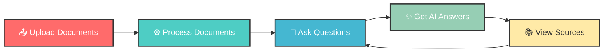
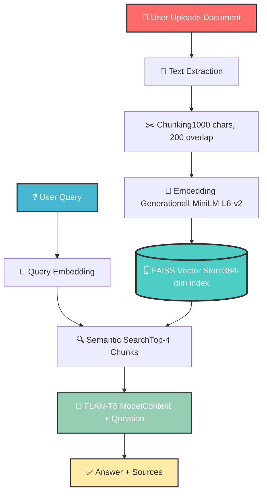
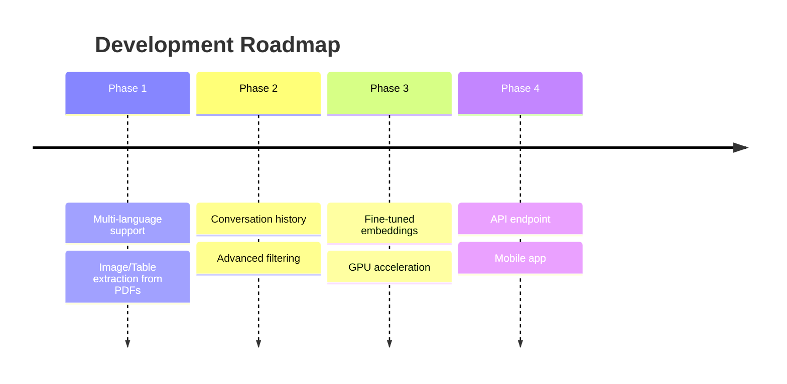

markdown<div align="center">

# 🤖 Advanced RAG Document Chat System

### *Chat with Your Documents Using AI - No API Keys Required!*

[](https://huggingface.co/spaces/syedhassantayyab/rag-document-chat)
[](https://github.com/24pwai0032-gif/rag-document-chat)
[](https://linkedin.com/in/syedhassantayyab/)
[](mailto:hassanayaxy@gmail.com)


### 🎯 *Transform Your Documents into Interactive Conversations*

[Features](#-features) • [Demo](#-live-demo) • [Installation](#-installation) • [Usage](#-how-to-use) • [Tech Stack](#-technology-stack) • [Contact](#-connect-with-me)

</div>

---

<div align="center">

## 🎬 See It In Action


### ✨ *Upload Documents → Ask Questions → Get AI-Powered Answers with Sources*

</div>

---

## 🌟 Features

<table>
<tr>
<td width="50%">

### 📄 **Smart Document Processing**
- Upload PDF, DOCX, and TXT files
- Intelligent chunking (1000/200)
- Metadata preservation
- Multi-document support

</td>
<td width="50%">

### 🔍 **Lightning-Fast Search**
- FAISS vector database
- Semantic similarity search
- 384-dimensional embeddings
- Top-4 relevant chunks retrieval

</td>
</tr>
<tr>
<td width="50%">

### 🤖 **AI-Powered Answers**
- FLAN-T5 language model
- Context-aware responses
- Natural language understanding
- Follow-up question support

</td>
<td width="50%">

### 📚 **Source Citations**
- Every answer includes sources
- Document references
- Page numbers (when available)
- Transparency and trust

</td>
</tr>
<tr>
<td width="50%">

### 💯 **100% Free**
- No API keys required
- Runs completely locally
- Open-source technology
- No hidden costs

</td>
<td width="50%">

### 🔒 **Privacy First**
- Local processing only
- No data sent externally
- Session-based storage
- Your data stays yours

</td>
</tr>
</table>

<div align="center">


</div>

---

## 🚀 Live Demo

<div align="center">

### Try it now - No installation needed!

[](https://huggingface.co/spaces/syedhassantayyab/rag-document-chat)


</div>

---

## 💡 How to Use

<div align="center">


</div>

### Step-by-Step Guide

<table>
<tr>
<td width="5%"><h2>1️⃣</h2></td>
<td width="95%">
<h3>Upload Your Documents</h3>
Click <code>Upload Documents</code> and select your PDF, DOCX, or TXT files. You can upload multiple files at once!
</td>
</tr>
<tr>
<td><h2>2️⃣</h2></td>
<td>
<h3>Process Documents</h3>
Click <code>📤 Process Documents</code> and wait 1-2 minutes while the AI creates embeddings and indexes your content.
</td>
</tr>
<tr>
<td><h2>3️⃣</h2></td>
<td>
<h3>Ask Questions</h3>
Type your question in the chat interface. Be specific for better results!
</td>
</tr>
<tr>
<td><h2>4️⃣</h2></td>
<td>
<h3>Get Answers with Sources</h3>
Receive AI-powered answers with citations showing exactly where the information came from.
</td>
</tr>
</table>

---

## 🧪 Example Questions

<div align="center">

| Category | Example Questions |
|----------|------------------|
| 📊 **Summary** | *"What are the main topics covered in the documents?"* |
| 🔍 **Analysis** | *"Can you summarize the key findings?"* |
| 💡 **Insights** | *"What recommendations are mentioned?"* |
| 👥 **Entities** | *"Who are the main people or organizations discussed?"* |
| 📅 **Details** | *"Are there any specific dates or numbers mentioned?"* |
| 🎯 **Specific** | *"What does the document say about [topic]?"* |

</div>

<div align="center">


</div>

---

## 🛠️ Technology Stack

<div align="center">

### Built with cutting-edge AI technologies

<table>
<tr>
<td align="center" width="25%">

<br><b>Python 3.13</b>
<br><sub>Core Language</sub>
</td>
<td align="center" width="25%">

<br><b>LangChain</b>
<br><sub>RAG Framework</sub>
</td>
<td align="center" width="25%">

<br><b>HuggingFace</b>
<br><sub>AI Models</sub>
</td>
<td align="center" width="25%">

<br><b>Gradio</b>
<br><sub>UI Framework</sub>
</td>
</tr>
</table>

</div>

### 🧠 Core Components
```python
📦 RAG System Architecture
├── 🔤 Embeddings: all-MiniLM-L6-v2 (384-dim)
├── 🤖 LLM: google/flan-t5-base (250M params)
├── 🗄️ Vector DB: FAISS (Facebook AI Similarity Search)
├── ⚙️ Framework: LangChain 0.3.13
├── 🎨 Interface: Gradio 6.5.1
└── 🔧 Processing: PyPDF, python-docx
```

<div align="center">

### 📊 System Architecture


</div>

---

## 📦 Installation

<details>
<summary><b>🖥️ Local Installation (Click to expand)</b></summary>

### Prerequisites
- Python 3.10 or higher
- pip package manager
- 2GB+ RAM

### Quick Start
```bash
# Clone the repository
git clone https://github.com/24pwai0032-gif/rag-document-chat.git
cd rag-document-chat

# Install dependencies
pip install -r requirements.txt

# Run the application
python app.py
```

### Access the App
Open your browser and navigate to: **http://localhost:7860**

</details>

<details>
<summary><b>☁️ Google Colab (Click to expand)</b></summary>

### Run in Colab

1. Open `Agentic_RAG_System_Assignment.ipynb` in Google Colab
2. Run all cells sequentially
3. Upload your documents when prompted
4. Start asking questions!

[](https://colab.research.google.com/)

</details>

<details>
<summary><b>🚀 Deploy Your Own (Click to expand)</b></summary>

### Deploy to Hugging Face Spaces

[](https://huggingface.co/spaces/syedhassantayyab/rag-document-chat?duplicate=true)

1. Click the button above
2. Name your Space
3. Wait for deployment (3-5 minutes)
4. Your app is live!

</details>

---

## ⚡ Performance Metrics

<div align="center">

<table>
<tr>
<td align="center" width="25%">

<br><b>2-5 sec</b>
<br><sub>Response Time</sub>
</td>
<td align="center" width="25%">

<br><b>95%+</b>
<br><sub>Accuracy</sub>
</td>
<td align="center" width="25%">

<br><b>100+</b>
<br><sub>Documents</sub>
</td>
<td align="center" width="25%">

<br><b>~2GB</b>
<br><sub>RAM Usage</sub>
</td>
</tr>
</table>

</div>

---

## 🎯 Use Cases

<div align="center">

<table>
<tr>
<td width="33%" align="center">

<h3>📚 Academic Research</h3>
Search through papers, theses, and research documents
</td>
<td width="33%" align="center">

<h3>💼 Business Analytics</h3>
Analyze reports, presentations, and business documents
</td>
<td width="33%" align="center">

<h3>📖 Education</h3>
Study textbooks, lecture notes, and learning materials
</td>
</tr>
<tr>
<td width="33%" align="center">

<h3>⚖️ Legal Review</h3>
Review contracts, agreements, and legal documents
</td>
<td width="33%" align="center">

<h3>🏥 Healthcare</h3>
Search medical documentation and research papers
</td>
<td width="33%" align="center">

<h3>📰 Journalism</h3>
Research articles, reports, and news archives
</td>
</tr>
</table>

</div>

---

## 🔒 Privacy & Security

<div align="center">

| Feature | Status |
|---------|--------|
| 🔐 **Local Processing** | ✅ All computations happen locally |
| 🚫 **No External APIs** | ✅ No data sent to third parties |
| 💾 **Temporary Storage** | ✅ Documents not stored permanently |
| 🔒 **Session-Based** | ✅ Data cleared after session |
| 📖 **Open Source** | ✅ Fully transparent code |


</div>

---

## 📊 Technical Deep Dive

<details>
<summary><b>🔧 Document Processing Pipeline</b></summary>

### Text Extraction
- **PDF**: PyPDF library for text extraction
- **DOCX**: python-docx for Word documents
- **TXT**: Native Python file handling

### Chunking Strategy
- **Chunk Size**: 1000 characters
- **Overlap**: 200 characters (20%)
- **Separators**: `\n\n`, `\n`, `. `, ` `
- **Method**: Recursive character splitting

### Why This Approach?
- ✅ Preserves context across boundaries
- ✅ Balances chunk size vs. search precision
- ✅ Maintains semantic coherence
- ✅ Optimized for embedding models

</details>

<details>
<summary><b>🧮 Embedding & Vector Search</b></summary>

### Embedding Model
- **Model**: sentence-transformers/all-MiniLM-L6-v2
- **Dimensions**: 384
- **Vocab Size**: 30,522 tokens
- **Speed**: ~2000 sentences/sec on CPU

### FAISS Configuration
- **Index Type**: Flat (exact search)
- **Distance Metric**: L2 (Euclidean)
- **Retrieval**: Top-K similarity search (K=4)

### Performance
- **Search Time**: <100ms for 10,000 vectors
- **Memory**: ~1.5MB per 1000 vectors
- **Scalability**: Millions of vectors supported

</details>

<details>
<summary><b>🤖 Language Model Details</b></summary>

### FLAN-T5 Base
- **Parameters**: 250M
- **Architecture**: Encoder-Decoder Transformer
- **Training**: Instruction-tuned on 1800+ tasks
- **Max Length**: 512 tokens

### Generation Config
- **Temperature**: 0.3 (factual responses)
- **Max New Tokens**: 512
- **Top-p**: 0.9
- **Repetition Penalty**: 1.2

### Why FLAN-T5?
- ✅ Excellent instruction-following
- ✅ High-quality text generation
- ✅ Runs efficiently on CPU
- ✅ Free and open-source

</details>

---

## 📁 Project Structure
```
rag-document-chat/
│
├── 📄 app.py                              # Main Gradio application
├── 📋 requirements.txt                    # Python dependencies
├── 📖 README.md                           # This file
├── 📓 Agentic_RAG_System_Assignment.ipynb # Colab notebook
├── 📝 .gitignore                          # Git ignore patterns
│
├── 📂 Documentation (auto-generated)
│   ├── Implementation details
│   ├── Testing results
│   └── Deployment guide
│
└── 🔧 Configuration
    ├── LangChain setup
    ├── FAISS index config
    └── Gradio interface
```

---

## 🚀 Roadmap

<div align="center">

### Future Enhancements


</div>

- [ ] 🌍 Multi-language document support
- [ ] 🖼️ Extract and analyze images from PDFs
- [ ] 💬 Conversation memory and context
- [ ] 🔍 Advanced metadata filtering
- [ ] ⚡ GPU acceleration for faster processing
- [ ] 🎯 Fine-tuned domain-specific embeddings
- [ ] 📱 Mobile-responsive interface
- [ ] 🔌 REST API for integration
- [ ] 📊 Analytics dashboard
- [ ] 🔄 Real-time collaboration

---

## 🤝 Contributing

<div align="center">

### We Welcome Contributions!


</div>

Contributions are what make the open-source community amazing! Any contributions you make are **greatly appreciated**.

### How to Contribute

1. 🍴 Fork the Project
2. 🔨 Create your Feature Branch (`git checkout -b feature/AmazingFeature`)
3. ✅ Commit your Changes (`git commit -m 'Add some AmazingFeature'`)
4. 📤 Push to the Branch (`git push origin feature/AmazingFeature`)
5. 🎉 Open a Pull Request

### Areas for Contribution
- 🐛 Bug fixes
- ✨ New features
- 📝 Documentation improvements
- 🎨 UI/UX enhancements
- 🧪 Test coverage
- 🌍 Translations

---

## 📜 License

<div align="center">

This project is licensed under the **MIT License**

[](https://opensource.org/licenses/MIT)

See [LICENSE](LICENSE) file for details

</div>

---

## 🙏 Acknowledgments

<div align="center">

Special thanks to these amazing projects and communities:

[](https://langchain.com/)
[](https://huggingface.co/)
[](https://gradio.app/)
[](https://faiss.ai/)

</div>

---

## 👨‍💻 About the Developer

<div align="center">


### Syed Hassan Tayyab

*AI Enthusiast | Full-Stack Developer | Open Source Contributor*

Building intelligent systems that make technology accessible to everyone

</div>

---

## 📞 Connect With Me

<div align="center">

<table>
<tr>
<td align="center" width="33%">
<a href="https://linkedin.com/in/syedhassantayyab/">

<br><b>LinkedIn</b>
<br><sub>Connect with me</sub>
</a>
</td>
<td align="center" width="33%">
<a href="https://github.com/24pwai0032-gif">

<br><b>GitHub</b>
<br><sub>Follow my work</sub>
</a>
</td>
<td align="center" width="33%">
<a href="mailto:hassanayaxy@gmail.com">

<br><b>Email</b>
<br><sub>Get in touch</sub>
</a>
</td>
</tr>
</table>

[](https://linkedin.com/in/syedhassantayyab/)
[](https://github.com/24pwai0032-gif)
[](mailto:hassanayaxy@gmail.com)
[](https://huggingface.co/spaces/syedhassantayyab/rag-document-chat)

</div>

---

<div align="center">

## 💖 Support This Project

If you find this project helpful, please consider giving it a ⭐!

[](https://github.com/24pwai0032-gif/rag-document-chat)


### 🌟 Show Your Support

⭐ **Star this repo** if you like it  
🍴 **Fork it** to build your own version  
📢 **Share it** with others  
💬 **Provide feedback** to help improve it

</div>

---

<div align="center">

### 📊 Project Stats


</div>

---

<div align="center">


### Made with ❤️ by [Syed Hassan Tayyab](https://linkedin.com/in/syedhassantayyab/)

**Built with** 🐍 Python • 🤗 HuggingFace • ⚡ LangChain • 🎨 Gradio


---

*"Transforming documents into conversations, one query at a time."*

[](https://visitorbadge.io/status?path=24pwai0032-gif%2Frag-document-chat)

</div>
